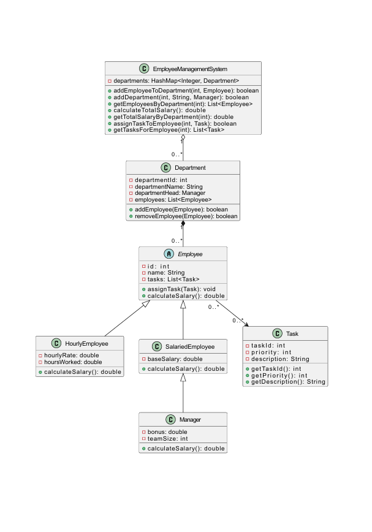

# Employee Management System

The Employee Management System is designed to manage employees, departments, and tasks within an organization using Object-Oriented Programming (OOP) concepts and Data Structures for efficiency and flexibility.

## OOP Concepts Used
The project is built using **Object-Oriented Programming (OOP) principles**, with several classes designed to represent different entities, such as:
- `Employee`: A base class representing employees.
- `HourlyEmployee`, `SalariedEmployee`, and `Manager`: Specialized classes inheriting from `Employee`.
- `Task`: A class to manage tasks.
- `Department`: A class to manage departments.

### Key OOP Features:
1. **Inheritance:** Used to reduce redundancy and extend functionalities across classes.
2. **Encapsulation:** Protecting data and restricting access through specific methods.
3. **Polymorphism:** General methods that work with multiple types of employees.

## Data Structures Used
The project utilizes various data structures to ensure efficiency, including:
- **List:** To store the list of employees.
- **HashMap:** To associate departments with employees.
- **PriorityQueue:** To manage tasks based on priority.

## UML Diagram

